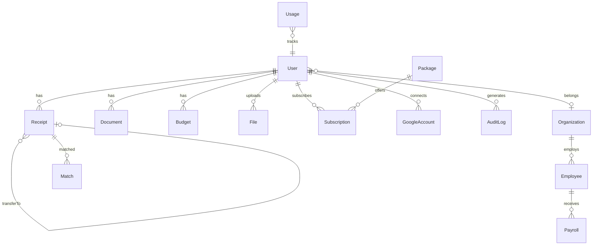

# iPED Full System Audit Report

**Date:** 2026-03-20
**Version:** v1.0-stable (commit 68bc86b)
**Auditor:** Claude Code

---

## 1. Project Overview

| Item | Detail |
|------|--------|
| Framework | Next.js 16.1.6 + React 19.2.4 |
| Language | TypeScript 5.9.3 |
| Database | MongoDB (Mongoose 9.3.0) |
| CSS | Tailwind CSS 4.2.1 |
| Auth | JWT (jose) + LINE OAuth |
| AI | Anthropic Claude (OCR + Chat) |
| Hosting | Docker on Hostinger VPS |
| Tests | None |
| CI/CD | None |

### Folder Structure
```
src/
  app/           155+ pages/routes
    (dashboard)/ Desktop dashboard (personal/business)
    (mobile)/    Mobile LIFF app
    api/         50+ API endpoints
    pricing/     Public pricing page
  components/    20+ shared components
  contexts/      ThemeContext, ModeContext
  hooks/         useReactiveMode
  lib/           15+ utilities (auth, ocr, quota, line-bot)
  models/        16 MongoDB schemas
  types/         TypeScript definitions
  middleware.ts  Route protection
```

---

## 2. Auth / LINE Login Flow

| Check | Status | Detail |
|-------|--------|--------|
| CSRF (state param) | :white_check_mark: | UUID state in OAuth URL |
| Cookie HttpOnly | :white_check_mark: | Set in setTokenCookie() |
| Cookie SameSite | :white_check_mark: | Lax |
| Cookie Secure | :white_check_mark: FIXED | Added for production |
| JWT Expiry | :white_check_mark: | 7 days |
| JWT Secret | :white_check_mark: FIXED | Fails fast if missing in production |
| Duplicate check | :white_check_mark: | findOne({ lineUserId }) |
| Route protection | :white_check_mark: | middleware.ts + withAuth/withAdmin |
| Logout | :warning: | Cookie cleared, no server-side revocation |
| Refresh token | :x: | Not implemented (static 7-day TTL) |

---

## 3. Security Audit

### Fixed Issues

| Issue | Severity | Status |
|-------|----------|--------|
| JWT_SECRET insecure default in production | CRITICAL | :white_check_mark: FIXED — throws Error |
| Cookie missing Secure flag | CRITICAL | :white_check_mark: FIXED — added for production |
| Sensitive data in console.log | HIGH | :white_check_mark: FIXED — removed token/profile logs |
| No security headers (CSP, HSTS) | HIGH | :white_check_mark: FIXED — added 5 headers |
| RegExp injection in admin search | HIGH | :white_check_mark: FIXED — escaped input |

### Remaining Issues

| Issue | Severity | Recommendation |
|-------|----------|----------------|
| Base64 images in MongoDB | MEDIUM | Move to S3/GCS with signed URLs |
| Google tokens stored plaintext | MEDIUM | Encrypt with crypto module |
| No rate limiting on auth | MEDIUM | Add rate limiter middleware |
| No Zod/Joi validation | MEDIUM | Add schema validation on endpoints |
| 469 `any` types | LOW | Progressive typing improvement |
| No tests (0% coverage) | LOW | Add critical path tests |

---

## 4. Performance

| Check | Status | Detail |
|-------|--------|--------|
| MongoDB indexes | :white_check_mark: | Comprehensive on all hot queries |
| Connection pooling | :white_check_mark: | Cached connection via global |
| Pagination | :white_check_mark: | getPagination() helper, max 100 |
| Lazy loading | :white_check_mark: | Dynamic imports + Suspense |
| N+1 queries | :warning: | Dashboard monthly trend (12 queries) |
| Event listener cleanup | :white_check_mark: | Proper useEffect cleanup |
| Bundle optimization | :white_check_mark: | Standalone output, code splitting |

---

## 5. Code Structure

| Check | Status | Detail |
|-------|--------|--------|
| Layer separation | :white_check_mark: | lib/ for logic, api/ for routes |
| Error handling | :white_check_mark: | try-catch on all API routes |
| Error response format | :warning: | Mostly consistent (apiError/apiSuccess) |
| Input validation | :warning: | Manual only, no schema library |
| Dead code | :white_check_mark: | None found |
| TODO/FIXME | :white_check_mark: | None found |
| Config management | :white_check_mark: | .env with .gitignore |

---

## 6. Database Schema

### 16 Models

| Model | Timestamps | Indexes | Unique | Notes |
|-------|:----------:|:-------:|:------:|-------|
| User | :white_check_mark: | 5 | email, lineUserId | Core user |
| Receipt | :white_check_mark: | 6 | — | Main data model |
| Document | :white_check_mark: | 10 | — | Business documents |
| Organization | :white_check_mark: | 2 | taxId | Company |
| Employee | :white_check_mark: | 3 | orgId+code | HR |
| Payroll | :white_check_mark: | 3 | — | Monthly payslips |
| Package | :white_check_mark: | 1 | tier | 6 subscription tiers |
| Subscription | :white_check_mark: | 3 | userId | User-package link |
| Usage | :white_check_mark: | 1 | userId+month+year | Monthly quotas |
| Match | :white_check_mark: | 3 | — | Receipt pairs |
| Budget | :white_check_mark: | 4 | — | Spending budgets |
| File | :white_check_mark: | 2 | — | Uploaded files |
| GoogleAccount | :white_check_mark: | 1 | userId+email | OAuth tokens |
| AuditLog | :white_check_mark: | 5+TTL | — | 90-day auto-delete |
| Notification | :white_check_mark: | 2 | — | User notifications |

### ER Diagram



---

## 7. Dependencies

| Category | Package | Version | Status |
|----------|---------|---------|--------|
| Core | next | 16.1.6 | :white_check_mark: |
| Core | react | 19.2.4 | :white_check_mark: |
| Core | typescript | 5.9.3 | :white_check_mark: |
| DB | mongoose | 9.3.0 | :white_check_mark: |
| Auth | jose | 6.2.1 | :white_check_mark: |
| AI | @anthropic-ai/sdk | 0.78.0 | :white_check_mark: |
| LINE | @line/liff | 2.27.3 | :white_check_mark: |
| UI | tailwindcss | 4.2.1 | :white_check_mark: |
| UI | lucide-react | 0.383.0 | :white_check_mark: |
| Util | date-fns | 4.1.0 | :white_check_mark: |

No known CVEs in declared dependencies.

---

## Summary

| Severity | Found | Fixed | Remaining |
|----------|:-----:|:-----:|:---------:|
| :red_circle: Critical | 5 | 5 | 0 |
| :orange_circle: High | 8 | 5 | 3 |
| :yellow_circle: Medium | 8 | 0 | 8 |
| :green_circle: Good | 15 | — | — |

### Priority Roadmap

1. **Done** — JWT secret, Secure cookie, console.log cleanup, security headers, regex injection
2. **Next sprint** — Rate limiting, Zod validation, token refresh
3. **Backlog** — S3 migration, encrypt tokens, reduce `any` types, add tests
